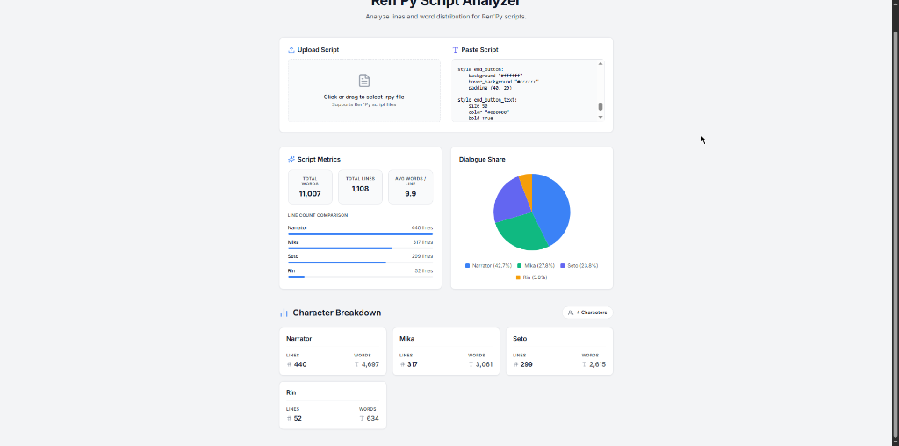

# Ren'Py Script Analyzer



A web application for analyzing Ren'Py visual novel scripts (.rpy).

It parses script files in the browser to extract dialogue metrics, character distribution, and workload data.

## Features

- Local processing (no server uploads required)
- File upload support for .rpy files
- Direct text paste support for script blocks
- Automatic character identification via define statements or direct strings
- Word count and line count calculations per character
- Average words-per-line density metrics
- Line count comparison charts
- Proportional word share visualizations

## How to Use

1. Open the application in your browser.
2. Either upload a .rpy file using the upload zone on the left, or paste Ren'Py script text directly into the text editor on the right.
3. The analyzer will automatically detect characters from your script using their define statements (e.g. `define e = Character("Eileen")`) or bare string identifiers.
4. Once parsed, the dashboard will display:
   - Total word count, line count, and average words per line across the entire script.
   - A horizontal bar chart showing line count per character, sorted by volume.
   - A pie chart showing each character's proportional share of total words.
   - A per-character card breakdown showing individual line and word counts.
5. To analyze a different script, upload a new file or clear the text area and paste new content.

## Use Cases

- Voice Acting Workloads: Estimating line and word counts for voice actors to determine compensation and scheduling.
- Translation Scoping: Calculating total word counts per character for localization teams to estimate translation costs.
- Narrative Balancing: Analyzing character dialogue distribution to ensure screen time aligns with the narrative design.
- Editing and Proofreading: Identifying characters with unusually high word-per-line density that may require dialogue tightening.

## Getting Started

### Prerequisites

Node.js (v18 or newer recommended) and npm must be installed.

### Installation

Clone the repository and install dependencies:

```
git clone https://github.com/Maru4221/Renpy-script-analyzer.git
cd Renpy-script-analyzer
npm install
```

### Development Server

Run the application locally:

```
npm run dev
```
The application will be accessible at http://localhost:5173 by default.

### Production Build

Build the project for production deployment:

```
npm run build
```
The static output will be generated in the dist/ directory.

## Tech Stack

- React 19
- Vite
- Vanilla CSS
- Lucide React

## License

MIT License
